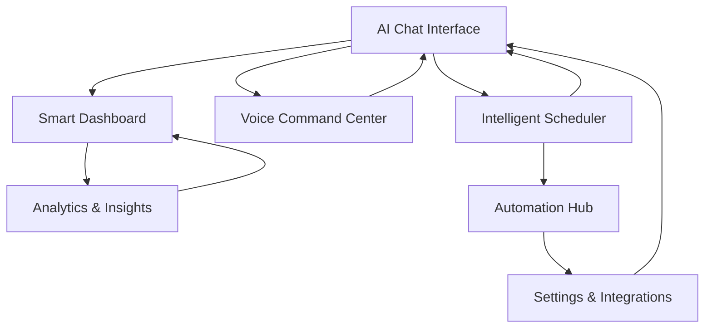

# AI Personal Assistant Enhancement - Product Requirements Document

## 1. Product Overview

Enhance the existing AI Personal Assistant with advanced conversational AI, intelligent automation, and predictive analytics to create a comprehensive productivity companion that learns from user behavior and proactively optimizes daily workflows.

The enhanced assistant will transform from a task management tool into an intelligent productivity partner that anticipates needs, provides contextual insights, and automates routine decisions through natural language interaction and smart integrations.

Target: Increase user productivity by 40% through AI-driven automation and reduce manual task management overhead by 60%.

## 2. Core Features

### 2.1 User Roles

| Role         | Registration Method                      | Core Permissions                                                                            |
| ------------ | ---------------------------------------- | ------------------------------------------------------------------------------------------- |
| Default User | Direct access (no auth required for MVP) | Full access to all AI assistant features, task management, habit tracking, and integrations |

### 2.2 Feature Module

Our enhanced AI Personal Assistant consists of the following main pages:

1. **AI Chat Interface**: Conversational AI dashboard, natural language commands, context-aware responses, chat history.
2. **Smart Dashboard**: AI insights panel, productivity analytics, predictive recommendations, performance metrics.
3. **Intelligent Scheduler**: AI-powered calendar optimization, automatic scheduling, conflict resolution, time blocking.
4. **Voice Command Center**: Voice recognition interface, hands-free task creation, audio feedback, voice settings.
5. **Automation Hub**: Workflow automation builder, trigger configuration, smart notifications, integration management.
6. **Analytics & Insights**: Productivity trends, behavior analysis, goal tracking, performance predictions.
7. **Settings & Integrations**: AI model configuration, external service connections, notification preferences, voice settings.

### 2.3 Page Details

| Page Name               | Module Name              | Feature description                                                                                                                                           |
| ----------------------- | ------------------------ | ------------------------------------------------------------------------------------------------------------------------------------------------------------- |
| AI Chat Interface       | Conversational AI Engine | Process natural language queries, maintain conversation context, provide intelligent responses with task creation, habit suggestions, and productivity advice |
| AI Chat Interface       | Chat History             | Store and retrieve conversation history, search previous interactions, bookmark important conversations                                                       |
| AI Chat Interface       | Quick Actions            | Voice-to-text input, predefined command shortcuts, emoji reactions, file attachments                                                                          |
| Smart Dashboard         | AI Insights Panel        | Display personalized productivity insights, identify patterns in work habits, suggest optimal work times                                                      |
| Smart Dashboard         | Predictive Analytics     | Forecast task completion times, predict habit success rates, recommend schedule adjustments                                                                   |
| Smart Dashboard         | Performance Metrics      | Track productivity scores, habit streaks, goal achievement rates, time allocation analysis                                                                    |
| Smart Dashboard         | Smart Recommendations    | AI-generated suggestions for task prioritization, habit formation, schedule optimization                                                                      |
| Intelligent Scheduler   | AI Calendar Optimization | Automatically arrange tasks based on priority, energy levels, and available time slots                                                                        |
| Intelligent Scheduler   | Conflict Resolution      | Detect scheduling conflicts, propose alternative arrangements, auto-reschedule when needed                                                                    |
| Intelligent Scheduler   | Time Blocking            | Create focused work blocks, buffer time allocation, meeting preparation time                                                                                  |
| Intelligent Scheduler   | Smart Reminders          | Context-aware notifications, location-based alerts, biometric-triggered reminders                                                                             |
| Voice Command Center    | Speech Recognition       | Convert voice commands to actions, support multiple languages, noise cancellation                                                                             |
| Voice Command Center    | Voice Task Creation      | Create tasks through voice input, set priorities and deadlines verbally, voice confirmation                                                                   |
| Voice Command Center    | Audio Feedback           | Provide spoken responses, task completion confirmations, daily briefings                                                                                      |
| Voice Command Center    | Voice Settings           | Configure voice models, adjust speech speed, set wake words, microphone calibration                                                                           |
| Automation Hub          | Workflow Builder         | Create custom automation rules, drag-and-drop workflow designer, conditional logic                                                                            |
| Automation Hub          | Smart Triggers           | Time-based triggers, location triggers, biometric thresholds, app usage patterns                                                                              |
| Automation Hub          | Integration Management   | Connect external services (Slack, email, calendar), API key management, sync status                                                                           |
| Automation Hub          | Notification Engine      | Smart notification delivery, priority-based alerts, do-not-disturb modes                                                                                      |
| Analytics & Insights    | Productivity Trends      | Visualize productivity patterns over time, identify peak performance periods, track improvement                                                               |
| Analytics & Insights    | Behavior Analysis        | Analyze task completion patterns, habit formation success, procrastination indicators                                                                         |
| Analytics & Insights    | Goal Tracking            | Set and monitor long-term goals, milestone tracking, progress visualization                                                                                   |
| Analytics & Insights    | Predictive Modeling      | Forecast future productivity, predict habit success, recommend goal adjustments                                                                               |
| Settings & Integrations | AI Configuration         | Select AI models, adjust response styles, set personality preferences, fine-tune behavior                                                                     |
| Settings & Integrations | External Services        | Configure Gmail, Google Fit, Slack, Notion, Todoist integrations, OAuth management                                                                            |
| Settings & Integrations | Notification Preferences | Customize alert types, set quiet hours, configure urgency levels, delivery methods                                                                            |
| Settings & Integrations | Privacy Controls         | Data retention settings, sharing preferences, export options, account deletion                                                                                |

## 3. Core Process

**Main User Flow:**
User opens the AI Chat Interface and interacts with the conversational AI using natural language. The AI processes requests, creates tasks/habits, provides insights, and suggests optimizations. Users can switch to the Smart Dashboard for analytics, use Voice Commands for hands-free interaction, configure Automation workflows, and review detailed Analytics. The system continuously learns from user behavior to improve recommendations.

**AI-Driven Automation Flow:**
The system monitors user patterns, biometric data, and external triggers to automatically create tasks, send smart notifications, optimize schedules, and execute predefined workflows without manual intervention.

## 4. User Interface Design

### 4.1 Design Style

* **Primary Colors**: Deep blue (#1e40af) for AI elements, emerald green (#059669) for completed actions

* **Secondary Colors**: Slate gray (#64748b) for text, amber (#f59e0b) for warnings, rose (#e11d48) for urgent items

* **Button Style**: Rounded corners (8px), subtle shadows, gradient backgrounds for primary actions

* **Fonts**: Inter for UI text (14px base), JetBrains Mono for code/data (12px), larger sizes (18px+) for headings

* **Layout Style**: Card-based design with glassmorphism effects, floating action buttons, sidebar navigation

* **Icons**: Lucide React icons with AI-themed custom illustrations, animated micro-interactions

### 4.2 Page Design Overview

| Page Name               | Module Name              | UI Elements                                                                                                                |
| ----------------------- | ------------------------ | -------------------------------------------------------------------------------------------------------------------------- |
| AI Chat Interface       | Conversational AI Engine | Chat bubbles with typing indicators, floating input with voice button, AI avatar with expressions, dark/light theme toggle |
| AI Chat Interface       | Chat History             | Collapsible sidebar with search, conversation threads, bookmark stars, infinite scroll                                     |
| Smart Dashboard         | AI Insights Panel        | Gradient cards with data visualizations, animated counters, progress rings, trend arrows                                   |
| Smart Dashboard         | Predictive Analytics     | Interactive charts (Chart.js), heatmaps for productivity, forecast graphs with confidence intervals                        |
| Intelligent Scheduler   | AI Calendar Optimization | Drag-drop calendar grid, color-coded time blocks, conflict indicators, optimization suggestions overlay                    |
| Voice Command Center    | Speech Recognition       | Waveform visualization, recording indicator, voice command history, language selector dropdown                             |
| Automation Hub          | Workflow Builder         | Node-based visual editor, connection lines, trigger/action blocks, test workflow button                                    |
| Analytics & Insights    | Productivity Trends      | Multi-line charts, date range picker, metric comparison toggles, export data button                                        |
| Settings & Integrations | AI Configuration         | Slider controls for AI parameters, personality selection cards, model comparison table                                     |

### 4.3 Responsiveness

Desktop-first design with mobile-adaptive layouts. Touch-optimized interactions for mobile devices including swipe gestures for task completion, pull-to-refresh for data sync, and voice command optimization for hands-free mobile usage.
